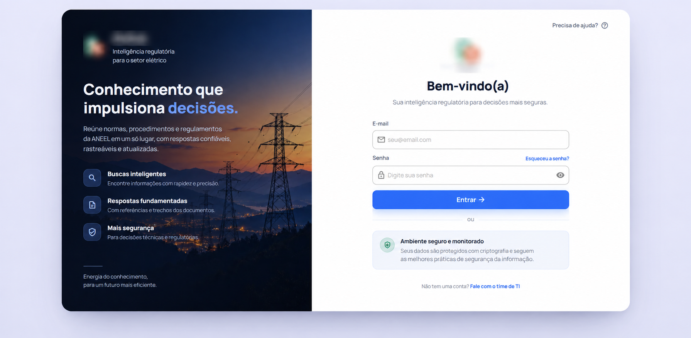
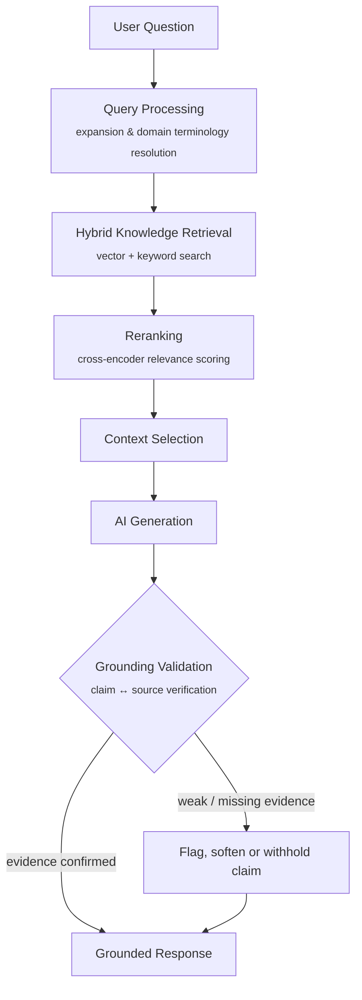
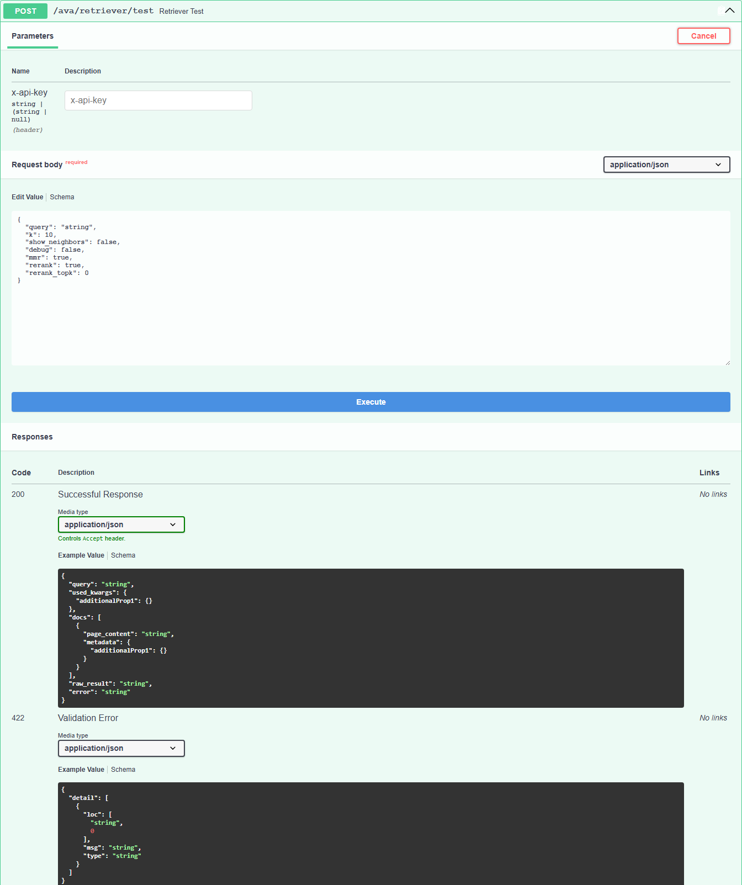
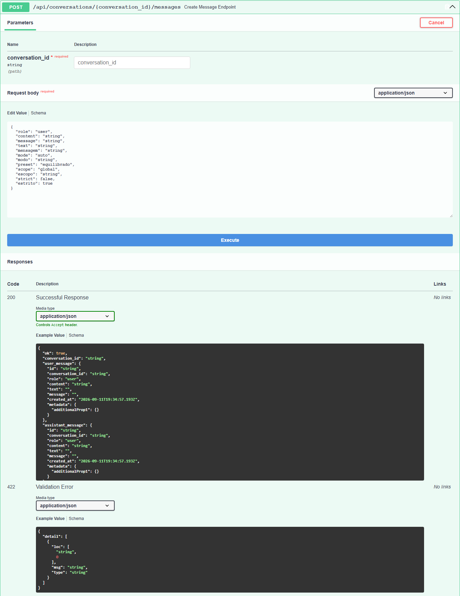

# Regulatory AI Platform

  <strong>Enterprise-grade platform for regulatory intelligence, technical knowledge retrieval and AI-assisted decision support.</strong>

  Full Stack Engineering · Applied AI · RAG · Information Retrieval · Product Engineering

---

## Overview

This project is a production-grade corporate AI platform designed to simplify access to complex regulatory and technical knowledge.

The system combines **Full Stack Software Engineering**, **Retrieval-Augmented Generation (RAG)**, document intelligence, information retrieval and production AI practices to provide contextual, traceable and evidence-based answers.

Rather than functioning as a general-purpose chatbot, the platform was designed around a core principle:

> **AI-generated answers should be grounded in authoritative source material.**

The application retrieves relevant evidence from an authorized knowledge base before generating a response, prioritizing reliability, traceability and production quality.

> This repository is a public engineering case study.  
> Production source code, proprietary data, internal infrastructure and sensitive implementation details are intentionally not disclosed.

---

## Product Experience

  

The interface shown above is a sanitized representation of the production product.

Corporate identifiers, internal URLs and sensitive information were removed for public presentation.

The platform was designed as a complete software product, including:

- responsive, mobile-friendly web interface
- authenticated user access
- conversational interaction with contextual sessions
- source traceability
- feedback workflows
- administrative capabilities

---

## The Problem

Regulatory and technical environments involve large volumes of documentation, standards, procedures and highly specialized terminology.

Finding a precise answer often requires:

- navigating multiple documents
- interpreting complex technical language
- locating specific sections and references
- comparing information across different sources
- validating whether information is relevant to the current context
- repeating manual research workflows

This makes technical knowledge retrieval slow, fragmented and highly dependent on specialist experience.

The goal of the platform was to transform this process into a faster and more intuitive workflow without sacrificing reliability.

---

## The Solution

The platform provides a conversational layer over an authorized technical knowledge base.

Users can interact through natural language while the system retrieves relevant evidence, processes contextual information and generates grounded responses.

At a product level, the system supports:

- natural-language interaction
- technical and regulatory information retrieval
- evidence-based, traceable responses
- structured knowledge access across document sets
- continuous quality improvement driven by evaluation and user feedback

---

## Engineering Scope

I worked across the complete development lifecycle of the platform — architecture, implementation, production deployment and continuous improvement — at the intersection of:

**Software Engineering × Applied AI × Product Engineering**

AI functionality was built as an integrated part of a real product, not as a standalone model demo: authentication, persistence, error handling and administrative workflows carried the same weight as retrieval quality.

### Frontend

- Responsive, mobile-friendly web application
- Authentication flows and application state management
- Conversational UI with interaction feedback
- API integration with the backend

### Backend

- System and REST API architecture
- Authentication and authorization
- Conversation and document persistence
- Document ingestion and processing services
- Configuration management, error handling and application monitoring

### Applied AI & Retrieval

- Designing the Retrieval-Augmented Generation architecture
- Implementing information retrieval strategies (hybrid search, ranking, context selection)
- Developing query interpretation and conversational context management
- Integrating language models into the application architecture
- Creating evaluation and regression-testing workflows
- Investigating retrieval failures and production regressions

### Production

- Deployment workflows and environment management
- Observability and performance analysis
- Failure investigation and regression prevention
- Operational maintenance

---

## Applied AI

The platform includes several layers of AI and information-retrieval engineering.

### Retrieval-Augmented Generation

The system uses external knowledge retrieval before language-model generation.

At a high level:

Two endpoints from the internal API, shown here at the schema level (no live data, no execution) to illustrate the retrieval and conversation contracts:

  

Retriever debug endpoint — exposes hybrid search and reranking controls independently of generation, used for evaluation and troubleshooting.

  

Conversation message endpoint — the contract behind each turn of a conversation, decoupled from the retrieval/generation internals above.

### Reliability & Grounding

A distinguishing part of this project was treating grounding as something to be actively verified, not assumed. Retrieval-augmented generation reduces hallucination risk but does not eliminate it — a model can still cite a real source while misrepresenting what it says, or answer confidently about the wrong entity when retrieval returns similar-but-incorrect matches.

To address this, the platform includes a dedicated verification layer that runs after generation and before a response reaches the user:

- **Claim-to-source verification** — checks whether cited passages actually support the specific claim being made, not just that a source exists.
- **Weak-evidence detection** — distinguishes between a source that *establishes* a fact and one that only *mentions* related terms, reducing over-generalization from partial matches.
- **Entity-match guarding** — flags cases where the model's answer refers to a different (but similar) entity, acronym or code than what the retrieved evidence actually contains.
- **Domain terminology resolution** — expands and normalizes acronyms and technical shorthand common in regulatory documents before retrieval runs, improving recall on jargon-heavy queries.
- **Document-ingestion safeguards** — defensive validation of uploaded files before content extraction.

This layer was built and refined iteratively against real failure cases surfaced during evaluation, rather than designed upfront, which is part of why regression testing and evaluation tooling were treated as first-class parts of the system rather than an afterthought.

---

### Tech Stack

> Listed at the library/category level to illustrate engineering scope. Environment configuration, infrastructure and deployment details are intentionally omitted.

| Layer | Technologies |
|---|---|
| API / Backend | FastAPI, Uvicorn, Pydantic |
| Auth | JWT, bcrypt |
| Database | PostgreSQL |
| RAG Orchestration | LangChain |
| Retrieval | FAISS (vector search), BM25 (keyword search) — hybrid |
| Reranking | Cross-encoder reranker (BAAI/bge-reranker-v2-m3), FlashRank |
| Document Processing | PDF/DOCX parsing, OCR (Tesseract) |
| LLM | OpenAI API |
| Caching / Sessions | Redis |

---

## Note

This repository documents the product, architecture and engineering decisions behind a real production system. Source code, credentials, internal URLs, client-identifying details and proprietary data are intentionally excluded.